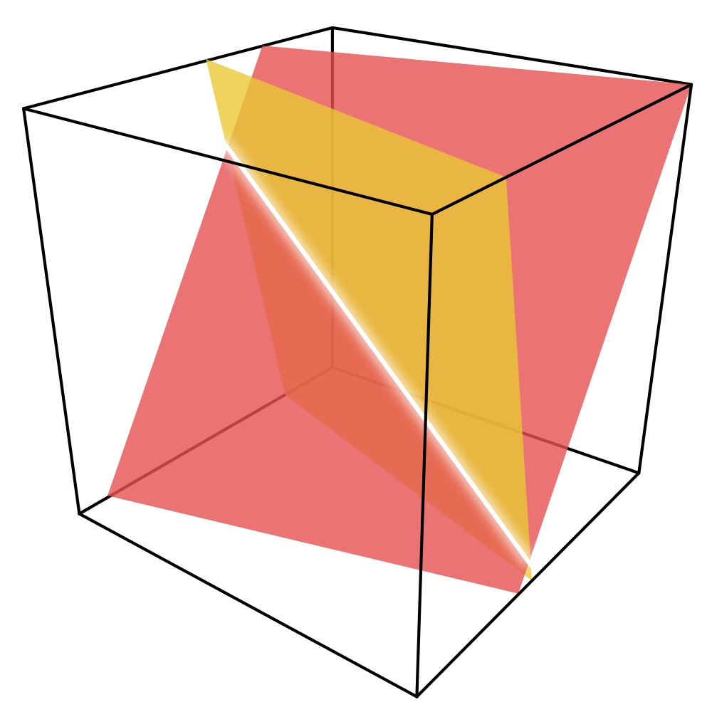

# subspace-segment

Hopefully time-efficient composition of filter and sort based on transducers.

*TODO* documentation, renaming, tests, and spec.

This is a raw dump of a namespace I use in other projects. It's
different, isolated from other code so I feel it makes sense to
extract it into a reusable library.

### Description with linear algebra

*TODO* in a clean but non technical way.
